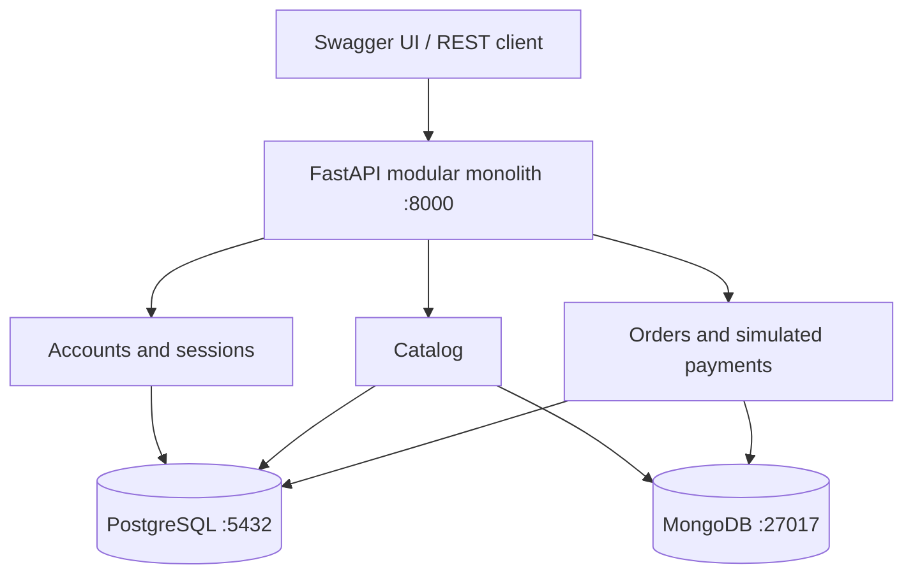
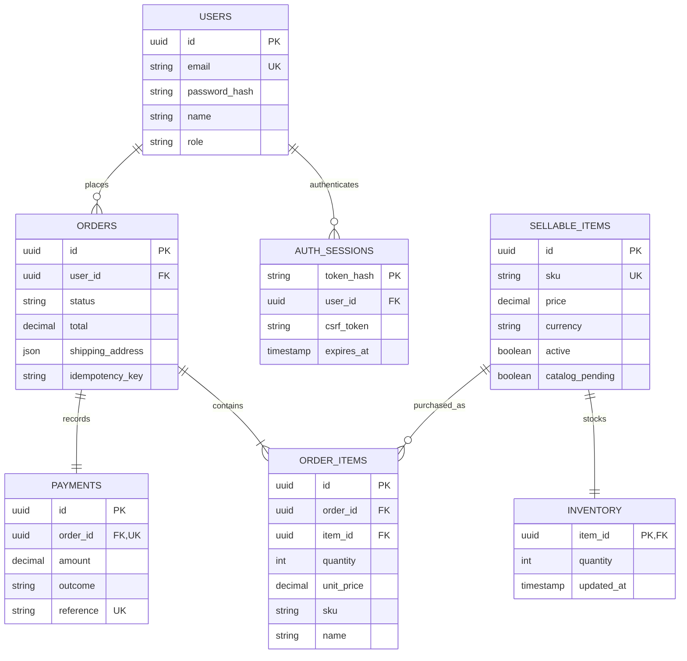

# PC Parts & Electronics Store — Checkpoint 1

Checkpoint 1 backend for **269340 Data Centric Application Development**. The project demonstrates a clear dual-database boundary using FastAPI, PostgreSQL and MongoDB.

- PostgreSQL is the source of truth for users, sessions, product prices, inventory, orders and payments.
- MongoDB stores the flexible product catalog and category-specific specifications.
- Docker Compose starts both databases and the API with persistent volumes and health checks.
- Deterministic seed automation creates more than 1,000 records in each database.

## Run the project

Requirements: Docker Desktop with Linux containers and Docker Compose.

```sh
docker compose up -d --build
docker compose exec -T api python -m app.seed
docker compose ps
```

Open the API documentation at `http://localhost:8000/docs` and the health check at `http://localhost:8000/api/v1/health`.

The default local demonstration accounts are:

| Role | Email | Password |
|---|---|---|
| Administrator | `admin@example.com` | `LocalAdmin123!` |
| Customer | `customer@example.com` | `LocalCustomer123!` |

Copy `.env.example` to `.env` to set different seed passwords before the first seed. Named volumes preserve both databases across restarts. Do not run `docker compose down -v` unless you intend to erase all local database data.

## Architecture



The API client never connects directly to either database. FastAPI owns validation, authorization and cross-database coordination.

### PostgreSQL data model



Alembic migrations in `backend/migrations/versions/` create the schema. PostgreSQL constraints enforce roles, order/payment states, unique values, positive order quantities and nonnegative prices and stock. Money uses fixed-precision decimal values.

### MongoDB data model

The `products` collection has common catalog fields and a category-specific `specifications` object:

```json
{
  "_id": "shared UUID string",
  "sku": "CS-CPU-001",
  "slug": "cpu-bundle-001",
  "name": "AMD Ryzen 7 7700",
  "brand": "AMD",
  "category": "cpu",
  "description": "Product description",
  "images": [],
  "specifications": {
    "socket": "AM5",
    "cores": 8,
    "threads": 16,
    "base_clock": 3.8,
    "power": 65
  },
  "schema_version": 1
}
```

A GPU uses `chipset`, `vram`, `memory_type` and `length`; a monitor uses `resolution`, `refresh_rate`, `panel` and `size`. The `category_definitions` collection defines required fields, types, units, allowed values and filterable fields for CPUs, GPUs, RAM, motherboards, monitors and laptops.

MongoDB validators reject incorrect document types and unknown specification fields. Indexes cover unique SKU/slug, category/brand, text search and common specification filters.

## Required REST endpoints

All routes use `/api/v1`.

| Method | Route | Database |
|---|---|---|
| POST | `/users` | PostgreSQL |
| GET | `/users/{id}` | PostgreSQL |
| GET | `/products` | MongoDB catalog + PostgreSQL price/stock |
| POST | `/products` | PostgreSQL + MongoDB |
| POST | `/orders` | MongoDB read + PostgreSQL transaction |

Additional routes support login/logout, current-user lookup, category definitions, individual products, inventory adjustment, order history and shipping status. Swagger UI documents every request and response schema.

The API returns standard status codes including `200`, `201`, `204`, `400`, `401`, `403`, `404`, `409` and `503`. Errors use this structure:

```json
{"error": {"status": 400, "message": "Explanation"}}
```

Authentication uses Argon2 password hashes and server-side sessions. Authenticated writes require a CSRF token. Public registration cannot assign an administrator role, and user/order access is owner-checked.

### Order consistency

Order creation uses both databases but is not a distributed ACID transaction. MongoDB supplies catalog snapshots; all commercial writes occur inside one PostgreSQL transaction.

1. Validate authentication, quantities, address and the `Idempotency-Key` header.
2. Read the matching MongoDB products.
3. Lock PostgreSQL inventory rows in stable UUID order.
4. Recheck active state, stock and authoritative prices.
5. Atomically write the order, line snapshots, payment and stock change.

Successful simulated payments reduce stock. Failed simulations record the failed order/payment without changing stock. Duplicate requests with the same key and payload return the original order; a changed payload returns `409`.

Product creation first stores an inactive pending SQL record, then writes the MongoDB document, then activates the SQL record. Exact retries are safe. Recovery can be inspected or applied with:

```sh
docker compose exec -T api python -m app.reconcile
docker compose exec -T api python -m app.reconcile --repair
```

## Seed data

Run the deterministic, repeat-safe seed:

```sh
docker compose exec -T api python -m app.seed
```

The clean initial seed creates:

| Database | Data |
|---|---|
| PostgreSQL | 51 users, 1,000 sellable items, 1,000 inventory rows, 100 orders, 100 order items and 100 payments — 2,351 total records |
| MongoDB | 1,000 products and 6 category definitions — 1,006 documents |

Stable identifiers prevent duplicates. Re-running the seed does not reset purchased stock or overwrite administrator changes.

## Tests and verification

```sh
docker compose exec -T api python -m pytest -q
docker compose exec -T api python -m alembic check
docker compose exec -T api python -m app.reconcile
```

The backend suite contains 14 integration tests using isolated `parts_store_test` databases. It covers all required endpoints, MongoDB validation, authorization, concurrent last-unit purchases, idempotency, failed payments, transaction rollback, dependency outages, recovery and repeatable seeding.

## Team roster

| Responsibility | Team member / student ID |
|---|---|
| PostgreSQL, checkout and migrations | เมธัส รัตนบุรี / 670615033 |
| MongoDB, catalog and seed data | โกเมทย์ ศศิสนธิ์ / 670615019 |
| REST API and authentication | วรินทร โตศักดิ์ / 670615034 |
| Docker, tests and documentation | วรินทร โตศักดิ์ / 670615034 |
